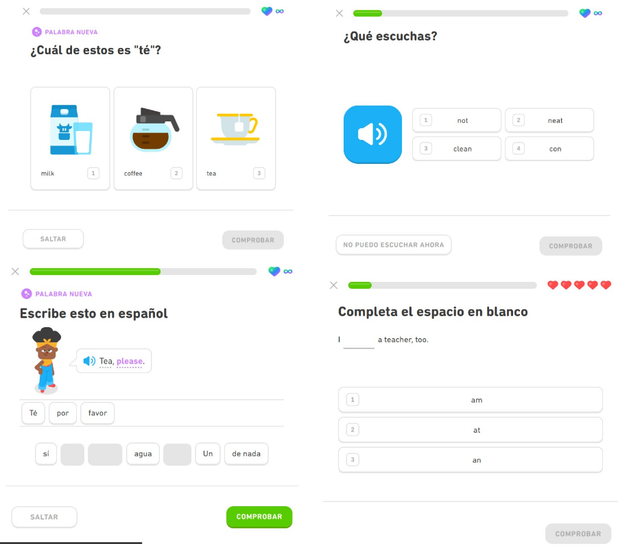

---  
title: Enunciado original del Proyecto
subtitle:  
description:  
keywords:  
status: desarrollo  
created: 2025-06-11  
modified: 2025-06-11  
author: "Juanjo Ruiz"  
---  
 
# Enunciado original del Proyecto

Inspirados por el éxito de aplicaciones de aprendizaje de idiomas como [DuoLingo](https://www.duolingo.com/) y de sistemas flashcards como [Mochi](https://mochi.cards/), se ha decidido construir una aplicación de aprendizaje que sirva para aprender y repasar conceptos en cualquier tipo de dominio. Por ejemplo, la aplicación permitiría crear cursos de idiomas, cursos de programación, prepararse para el concurso Pasapalabra, aprender teoría musical, etc.

El funcionamiento de este tipo de aplicaciones es habitualmente el siguiente: el usuario elige un curso o un tipo de contenido disponible y la aplicación va mostrando tarjetas o ejercicios uno a uno. Un curso puede tener diferentes bloques de contenidos, que contienen diferentes tipos de ejercicios, como por ejemplo:

- Preguntas tipo test
- Preguntas para completar huecos
- Preguntas para traducir
- Tarjetas para estudiar (*flashcards*), ***que no requieren introducir una respuesta***.

Dependiendo del dominio del curso, las preguntas[^1] serán de un tipo o de otro. A pesar de que la aplicación inicialmente se centrará en un dominio, el diseño del sistema debe permitir que se pueda extender con nuevos tipos de preguntas para poder adaptarlo a otros dominios.

[^1]: Se utilizará en este documento el término *pregunta* para denotar tanto una pregunta que el usuario tiene que responder como una pantalla con información para estudiar, y en general cualquier elemento que forme parte de un curso.

A modo de ejemplo, las siguientes figuras muestran capturas pantallas de Duolingo. Se puede observar que hay diferentes tipos y cada una tiene un tipo de interacción diferente. En el caso de Duolingo no hay pantallas con "flashcards" para aprender y memorizar teoría, pero podría ser otro tipo de pantalla.

En estas aplicaciones normalmente los cursos son fijos, pero sería interesante para fomentar el aspecto social de la plataforma que se puedan crear nuevos cursos de manera sencilla, compartirlos con otros usuarios y cargarlos en la aplicación.

## Objetivo de la práctica

Construir una aplicación como la descrita anteriormente. Cada grupo debe elegir un dominio sobre el que realizar el proyecto y diseñar la aplicación adaptándolo a ese dominio.

### Características mínimas

- Deben existir al menos **3 tipos de preguntas** (o pantallas de aprendizaje) diferentes, pero además debe ser posible añadir nuevos tipos de preguntas/*flashcards* de manera sencilla.
- Cuando un usuario va a realizar un curso, tiene que poder elegir la **estrategia de aprendizaje**, como puede ser:
  - Secuencial (una pregunta tras otra en un orden predefinido)
  - [Repetición espaciada](https://es.wikipedia.org/wiki/Repaso_espaciado), por ejemplo, repetir la misma pregunta una vez cada 3 preguntas
  - Aleatoria, etc.

- Cuando un usuario esté realizando un curso debe poder **guardarse el estado actual del curso y reanudarse en cualquier momento**.

- La aplicación debe **guardar estadísticas de uso** como contar el tiempo de uso, calcular la mejor racha (ej., número de días), etc.

- Se desea que los usuarios puedan **crear cursos y compartirlos** con otros usuarios. Es decir, la aplicación debe permitir instalar nuevos cursos en su biblioteca interna. Un curso estará definido como un fichero **JSON o YAML** por lo que no es necesario una interfaz de usuario para desarrollar los cursos.

> Además de estas características, **cada grupo deberá idear una característica adicional** que desea que tenga su sistema. Esta característica deberá ser documentada adecuadamente e integrada con el resto del sistema.

---

## Realización de la práctica

La práctica se realizará en **grupos de 3 estudiantes**. Cada grupo deberá crear un repositorio en GitHub en el que alojar el proyecto y trabajar activamente sobre el repositorio. Todos los artefactos del proyecto, incluyendo la documentación, deben estar alojados en el proyecto de GitHub. Se deberá utilizar GitHub para la gestión del proyecto.

### Modelado del sistema

- Se debe realizar un **modelado conceptual de dominio del problema** y definir los **casos de uso** y especificar en detalle los casos de uso más importantes.

### Implementación

La implementación deberá cumplir lo siguiente:

- Lenguaje de programación **Java**
- **Maven** como sistema de construcción
- Persistencia con **JPA**
- **Pruebas de software**. Se debe justificar la cobertura de código obtenida.

---

## Entregas

- **Entrega parcial 1** – Fecha tentativa: 02/03/2025
  - Identificación de casos de uso
  - Desarrollo de al menos dos casos de uso
  - Modelo de dominio
  - Ventanas de la aplicación (opcional, pero muy recomendable)

- **Entrega parcial 2** – Fecha tentativa: 03/04/2025
  - Casos de uso
    - Identificación
    - Desarrollo de los casos de uso implementados en la aplicación
  - Modelo de dominio final
  - Implementación
    - Funcionalidad básica
    - Tests

- **Entrega final**
  - Entrega anterior
  - Funcionalidad con persistencia y gestión de cursos serializados en JSON/YAML
  - Característica adicional ideada por el grupo

