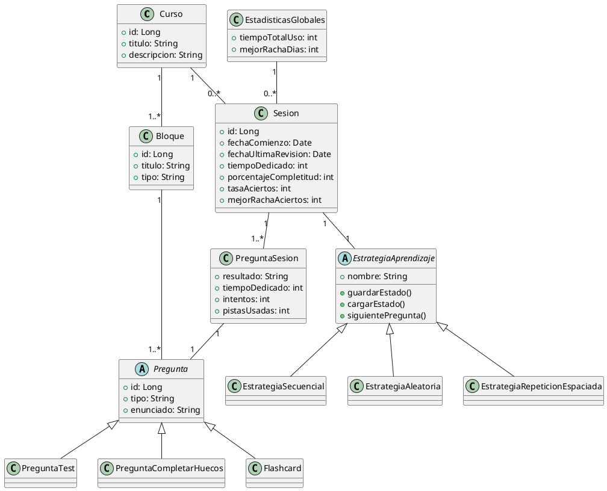

---  
title: Apuntes de pds-modelo-de-dominio 
subtitle:  
description:  
keywords:  
status: desarrollo  
created: 2025-06-11  
modified: 2025-06-11  
author: "Juanjo Ruiz"  
---  

# Modelo de dominio

El modelo de dominio representa los conceptos clave, relaciones y atributos necesarios para cubrir los casos de uso principales de la aplicación: inspección y gestión de cursos, sesiones de aprendizaje con distintas estrategias, seguimiento estadístico, uso de flashcards y persistencia del progreso. El diseño está inspirado en plataformas de aprendizaje como Duolingo y Mochi, y permite la extensión a nuevos tipos de preguntas y estrategias.

---

## Entidades principales

### **Curso**
- `id`: Identificador único
- `nombre`: Nombre del curso
- `descripcion`: Breve descripción
- `bloques`: Lista de bloques de contenido

### **Bloque**
- `id`: Identificador único
- `titulo`: Título del bloque
- `tipo`: Tipo de bloque (test, flashcards, completar huecos, etc.)
- `preguntas`: Lista de preguntas

### **Pregunta** (abstracta)
- `id`: Identificador único
- `tipo`: Tipo de pregunta (test, completar huecos, flashcard, etc.)
- `enunciado`: Texto o contenido principal
- `opciones`: Opciones de respuesta (si aplica)
- `respuestaCorrecta`: Respuesta correcta (si aplica)

#### Subtipos:
- `PreguntaTest`
- `PreguntaCompletarHuecos`
- `Flashcard`
- *(Otros tipos extensibles)*

### **Sesion**
- `id`: Identificador único
- `curso`: Referencia al curso
- `estrategia`: Estrategia de aprendizaje elegida
- `fechaComienzo`: Fecha y hora de inicio
- `fechaUltimaRevision`: Fecha y hora de la última actividad
- `tiempoDedicado`: Tiempo total acumulado
- `bloqueActual`: Referencia al bloque en curso
- `preguntaActual`: Referencia a la pregunta en curso
- `porcentajeCompletitud`: % de preguntas respondidas
- `tasaAciertos`: % de aciertos sobre preguntas respondidas
- `mejorRachaAciertos`: Mejor racha de aciertos consecutivos
- `preguntasSesion`: Lista de registros de pregunta en la sesión

### **PreguntaSesion**
- `pregunta`: Referencia a la pregunta
- `resultado`: acierto / fallo / sin contestar
- `tiempoDedicado`: Tiempo dedicado a responder (0 si no contestada)
- `intentos`: Número de intentos realizados
- `pistasUsadas`: Número de pistas solicitadas (opcional)
- `fechaRespuesta`: Fecha/hora de respuesta (opcional)

### **EstrategiaAprendizaje** (abstracta/interfaz)
- `nombre`: Nombre de la estrategia
- `estado`: Estado serializable (índice, orden, etc.)
- Métodos: `siguientePregunta()`, `guardarEstado()`, `restaurarEstado()`

#### Subtipos:
- `EstrategiaSecuencial`
- `EstrategiaAleatoria`
- `EstrategiaRepeticionEspaciada`
- *(Otros tipos extensibles)*

### **EstadisticasGlobales**
- `tiempoTotalUso`: Tiempo total de uso de la aplicación
- `mejorRachaDias`: Mejor racha de días de uso consecutivos
- `sesionesPorCurso`: Historial de sesiones por curso

---

## Relaciones principales

- Un **Curso** contiene varios **Bloques**.
- Un **Bloque** contiene varias **Preguntas**.
- Una **Sesion** está asociada a un **Curso** y a una **EstrategiaAprendizaje**.
- Una **Sesion** contiene una lista de **PreguntaSesion** para registrar el detalle de cada pregunta respondida.
- Las **EstadisticasGlobales** agregan información de todas las sesiones y cursos realizados.


## 4. Diagrama de clases (PlantUML)


---

## 5. Notas sobre el modelo

- El modelo cubre todos los casos de uso principales: inspección, inicio y reanudación de sesiones, flashcards, estadísticas y guardado automático.
- Permite la extensión a nuevos tipos de preguntas y estrategias.
- La persistencia y serialización del estado de la sesión y estrategia están contempladas para garantizar la reanudación exacta del aprendizaje[1].
- El diseño es compatible con la importación/exportación de cursos en formato JSON/YAML y con la gestión de estadísticas globales y por sesión.


### 1. **Modelo de dominio / Diseño de clases**
Incluye una subsección titulada, por ejemplo, **"Persistencia y restauración de sesiones"** dentro del capítulo donde describes la entidad `Sesion`. Ahí puedes explicar:

- Qué métodos tiene la clase.
- Qué información se persiste (incluyendo el estado del iterador de la estrategia).
- El motivo por el que es necesario guardar/restaurar el estado completo (alineado con el requisito funcional del enunciado: “Cuando un usuario esté realizando un curso debe poder guardarse el estado actual del curso y reanudarse en cualquier momento”[1]).

---

### 2. **Especificación de casos de uso**
En los casos de uso relacionados, como "Reanudar sesión" o "Guardar estado", puedes referenciar que la implementación requiere que se serialice/restaure el estado de la sesión y su estrategia.

---

### 3. **Documentación de arquitectura o diseño técnico**
Si tienes un documento de arquitectura o de diseño detallado, puedes incluir una sección sobre **"Gestión del ciclo de vida de la sesión"**, donde expliques la serialización/deserialización del iterador y cómo se garantiza la reanudación exacta.

---

### 4. **Comentarios en el código/documentación Javadoc**
En el propio código fuente, los métodos `guardarSesion` y `restaurarSesion` deben estar bien documentados, explicando su responsabilidad y relación con la persistencia del iterador de estrategia.

# Diagrama de Clases




## Clase: `Sesion`

### Métodos

La aplicación debe permitir guardar y reanudar el estado actual del curso y la sesión en cualquier momento, independientemente de la estrategia de aprendizaje utilizada, por tanto, la clase `Sesión` debe tener métodos para guardar y restaurar, que incluyan el estado del iterador de la estrategia. Esto garantiza que el usuario puede pausar y reanudar cualquier curso, con cualquier estrategia, exactamente donde lo dejó, cumpliendo el requisito funcional clave del enunciado.

Dado que la estrategia determina el orden y la lógica de navegación por las preguntas, **el estado del iterador de la estrategia** es esencial para poder restaurar la sesión exactamente donde se dejó.

- **guardarSesion()**: Serializa y persiste el estado completo de la sesión, incluyendo:
  - El identificador de la sesión y del curso.
  - El estado de la estrategia (incluyendo el iterador concreto y su estado interno).
  - El progreso (bloque y pregunta actual, estadísticas, etc.).
- **restaurarSesion()**: Recupera de la persistencia toda la información anterior y reconstruye:
  - El iterador de la estrategia correspondiente, restaurando su estado interno.
  - El punto exacto de avance y las estadísticas.


## Ejemplo conceptual (Java)

```java
public class Sesion {
    private Curso curso;
    private EstrategiaAprendizaje estrategia;
    private EstadoIterador estadoIterador; // Clase serializable con el estado interno
    private int bloqueActual;
    private int preguntaActual;
    // ... otros atributos y estadísticas

    public void guardarSesion() {
        // Serializa el estado de la sesión y del iterador de la estrategia
        estadoIterador = estrategia.guardarEstado();
        // Persistir la sesión (JPA, JSON, etc.)
    }

    public void restaurarSesion() {
        // Carga la sesión de la persistencia
        estrategia.cargarEstado(estadoIterador);
        // Restaura bloqueActual, preguntaActual, etc.
    }
}
```

Cada subclase de `EstrategiaAprendizaje` debe implementar los métodos `guardarEstado()` y `cargarEstado()` para asegurar que su iterador puede persistirse y restaurarse correctamente.


